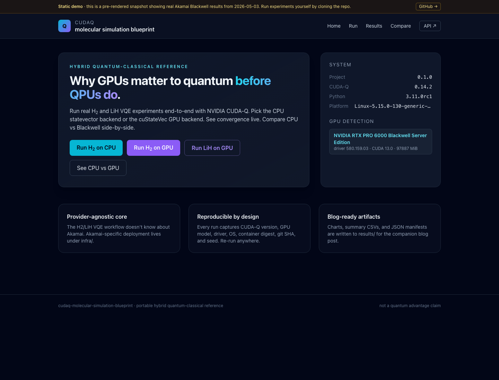
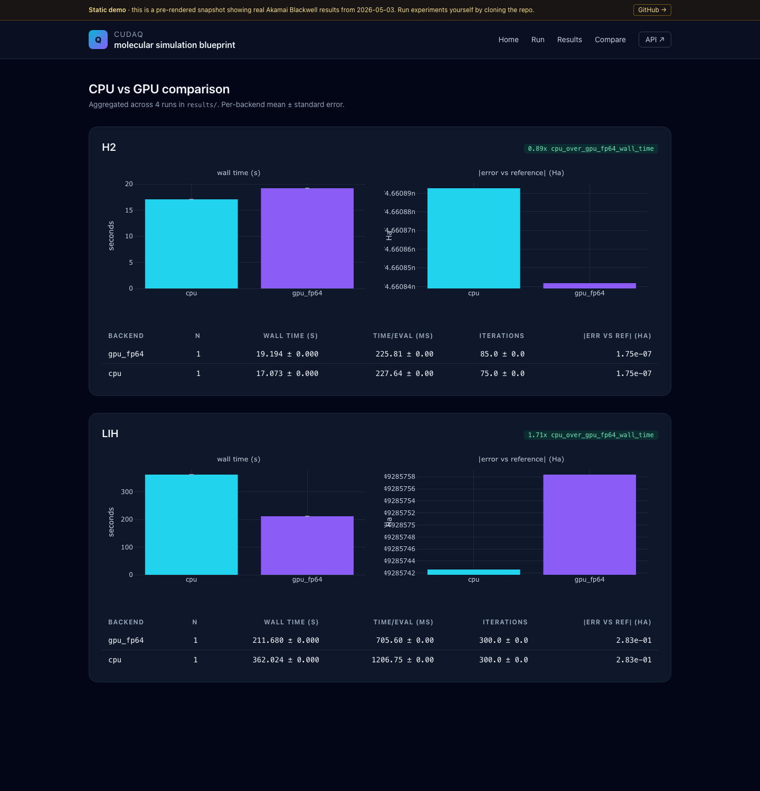
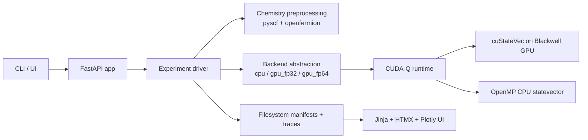

# cudaq-molecular-simulation-blueprint

> Hybrid quantum-classical molecular simulation reference implementation
> using NVIDIA CUDA-Q and cuQuantum, validated end-to-end on Akamai Cloud
> NVIDIA RTX PRO 6000 Blackwell GPUs.

[](https://github.com/jgdynamite/cudaq-molecular-simulation-blueprint/actions/workflows/ci.yml)
[](LICENSE)
[](https://www.python.org/downloads/)
[](https://nvidia.github.io/cuda-quantum/)

**Live UI demo (Akamai Object Storage):**
**<https://cudaq-blueprint-demo.website-us-east-1.linodeobjects.com/>**

[](https://cudaq-blueprint-demo.website-us-east-1.linodeobjects.com/)

The live demo is a pre-rendered snapshot of the FastAPI/HTMX UI hosted from
an Akamai Object Storage bucket. It shows the actual Jakarta Blackwell host
fingerprint (RTX PRO 6000 Blackwell, driver 580.159.03, CUDA 13.0, 96 GB
VRAM) and embeds the real run manifests, traces, and comparison report
inline. The "Run an experiment" form is intentionally inert in static mode
&mdash; clone the repo to run live.

This project supports the technical blog post **"Why GPUs Matter to Quantum
Before QPUs Do: Using CUDA-Q, cuQuantum, and Blackwell GPUs for Molecular
Simulation."** It exists to make the hybrid quantum workflow concrete,
runnable, and reproducible.

It is **not** a quantum-advantage claim, **not** a positioning of Akamai as
a dedicated quantum cloud, and **not** a cross-cloud benchmark. It **is** a
portable, public, Akamai-validated Blackwell-era reference implementation
for molecular simulation that you can read, run, and extend.

---

## Validated on Blackwell (Jakarta, 2026-05-03)

The full pipeline ran end-to-end on a `g3-gpu-rtxpro6000-blackwell-1` VM in
Akamai's `id-cgk` region. NVIDIA driver `nvidia-open-580.159.03`, CUDA 13.0,
96 GB VRAM, 16 vCPU, 172 GB system RAM. VM lifetime 1 h 17 min, billed cost
**$3.84**.

| Run | Backend | Qubits | Wall (s) | Energy (Ha) | Error vs FCI | Chem. acc. |
|---|---|---:|---:|---:|---:|:---:|
| H2  | qpp-cpu     |  4 | **17.07** | -1.137270 | -1.75e-07 | yes |
| H2  | nvidia:fp64 |  4 |     19.19 | -1.137270 | -1.75e-07 | yes |
| LiH | qpp-cpu     | 12 |    362.02 | -7.579105 | +2.83e-01 | (300/300 iter cap) |
| LiH | nvidia:fp64 | 12 | **211.68** | -7.579105 | +2.83e-01 | (300/300 iter cap) |

Two stories the data tells:

- **Small problem (H2, 4 qubits): GPU is 1.12x slower than CPU.**
  Host<->device transfer dominates a Hamiltonian this small.
- **Bigger problem (LiH, 12 qubits): GPU is 1.71x faster than CPU.**
  Identical convergence trajectory, 39% wall-time saving on the same 300
  COBYLA iterations. This is where the GPU starts paying its own freight.

[](https://cudaq-blueprint-demo.website-us-east-1.linodeobjects.com/compare/)

Each run is fully drillable. The screenshot below is the LiH GPU run on the
Blackwell card &mdash; energy descent over 300 function evaluations, dashed
orange line at the FCI reference, manifest and host fingerprint inline:

[](https://cudaq-blueprint-demo.website-us-east-1.linodeobjects.com/results/20260503T162302Z-57cbd7/)

Raw artifacts (manifests, traces, comparison report) are attached to the
GitHub Release as `akamai-jakarta-results-v0.1.0.tgz` (with SHA256 in
`akamai-jakarta-results-v0.1.0.sha256`). See
[docs/results-interpretation.md](docs/results-interpretation.md) for the
methodology and full discussion.

---

## Quick start (CPU, runs anywhere with Docker)

```bash
git clone https://github.com/jgdynamite/cudaq-molecular-simulation-blueprint.git
cd cudaq-molecular-simulation-blueprint

make container-build         # builds the multi-stage image (~5-8 min first time)
make container-run-cpu       # H2 VQE on qpp-cpu (converges in ~15-20 s)
make serve                   # demo UI on http://localhost:8000
```

CUDA-Q's Python wheel ships only Linux x86_64/ARM64 binaries (`cuda-quantum-cu12`
and `-cu13` on PyPI). On macOS or any other platform without those wheels,
use the Docker-based path above; the container handles the Linux runtime
transparently.

For a native Linux dev loop:

```bash
uv sync                                       # creates .venv with all deps
uv run cudaq-bp run h2 --backend cpu          # H2 VQE on the CPU
uv run cudaq-bp info                          # shows detected GPUs / backends
uv run pytest -m "not gpu and not slow"       # 36 tests in ~5 s
```

---

## GPU on Akamai (the validated path)

Provision an RTX PRO 6000 Blackwell VM, configure it, run the suite, tear
it down:

```bash
export LINODE_TOKEN=...
cd infra/terraform/akamai
cp terraform.tfvars.example terraform.tfvars  # then edit: SSH key, region, etc.

terraform init
terraform plan -out=tfplan
terraform apply tfplan                         # ~1-2 min
ansible-playbook -i inventory.ini ../../ansible/playbook.yml \
                 --private-key ~/.ssh/your-key  # ~12-15 min

ssh root@$(terraform output -raw public_ip) \
    "docker exec -u root -w /tmp cudaq-blueprint cudaq-bp bench compare"

terraform destroy                              # mandatory; cost meter stops
```

Akamai's RTX PRO 6000 Blackwell SKU is feature-gated; talk to your account
team to get it enabled. Stock currently lives in `id-cgk` (Jakarta) and
`br-gru` (Sao Paulo). Full walkthrough including firewall, NVIDIA driver
flavor, and image-distribution strategy in
[docs/akamai-deployment.md](docs/akamai-deployment.md).

---

## Deploy a public read-only UI snapshot (Akamai Object Storage)

Once you have benchmark results in `results/`, you can pre-render the UI to
a static bundle and host it on Akamai Object Storage for ~$5/month flat. The
result is the public `website-...linodeobjects.com` URL linked at the top
of this README.

```bash
uv run python -m app.ui.static_export \
    --results-dir results/akamai-jakarta \
    --output-dir _site

# Object Storage credentials must be created via Cloud Manager or the
# Linode API: POST /v4/object-storage/buckets and POST /v4/object-storage/keys
# (scope the key to the bucket only). Then:
aws s3 sync _site/ s3://<your-bucket>/ \
    --endpoint-url https://us-east-1.linodeobjects.com --acl public-read
aws s3api put-bucket-website --bucket <your-bucket> \
    --endpoint-url https://us-east-1.linodeobjects.com \
    --website-configuration \
    '{"IndexDocument":{"Suffix":"index.html"},"ErrorDocument":{"Key":"404.html"}}'
```

Notes from this project's first deployment:

- The bucket-creation API picks a sub-cluster automatically. We hit a
  broken `us-iad-10` cluster on first try (TLS handshake reset on every
  connection); recreating in `us-east` got us a healthy `us-east-1`
  bucket. If you see "Connection reset by peer" on `aws s3 ls`, delete
  the bucket and pick a different region.
- Set ACL to `public-read` on objects and explicitly `Content-Type:
  text/html; charset=utf-8` on every `index.html` (the auto-detection
  via `aws s3 sync` defaulted to `application/octet-stream` for some
  HTML files and the browser would offer them as a download).
- Use the `bucket.website-<cluster>.linodeobjects.com` URL for browsing,
  not the `bucket.<cluster>.linodeobjects.com` S3 endpoint. Only the
  former auto-resolves `/run/` to `/run/index.html`.

---

## What this project does



- Hartree-Fock chemistry preprocessing on CPU (`pyscf` + `openfermion`)
- Hamiltonian construction via `cudaq.chemistry.create_molecular_hamiltonian`
- UCCSD ansatz from `cudaq.kernels.uccsd` over a Hartree-Fock reference
- VQE optimization via SciPy COBYLA with full per-evaluation iteration trace
- Statevector simulation on either `qpp-cpu` (OpenMP) or `nvidia:fp64`
  (cuStateVec on the GPU)
- Side-by-side benchmarks comparing the two backends on H2 and LiH
- Live SSE-driven convergence plot in the demo UI

## Repository layout

```
cudaq-molecular-simulation-blueprint/
  app/            # provider-agnostic application (no Akamai-specific code)
    api/          # FastAPI routes + run coordinator
    cli/          # Typer CLI: cudaq-bp run|results|bench|info
    core/         # config, structlog, system info
    quantum/      # chemistry, ansatz, optimizers, H2/LiH VQE drivers
    benchmark/    # CPU vs GPU comparison harness
    storage/      # JSON manifests + traces on the filesystem
    ui/           # Jinja2 + HTMX + Tailwind (CDN) + Plotly (CDN)
    tests/        # 36 fast tests, no GPU required
  containers/     # Dockerfile + compose + entrypoint
  infra/          # Akamai-specific deployment (isolated)
    terraform/akamai/
    ansible/      # nvidia_driver, docker, app roles
    k8s/future/   # placeholder; LKE explicitly out of scope for v1
  docs/           # charter, architecture, methodology, deployment, results
  scripts/        # bootstrap, verify-gpu, run-* helpers
  results/        # written run artifacts (gitignored except .gitkeep)
  .github/workflows/  # ci, docs, release (-> GHCR)
```

## Documentation

- [Project charter](docs/project-charter.md)
- [Architecture](docs/architecture.md)
- [Experiment methodology](docs/experiment-methodology.md)
- [Akamai deployment](docs/akamai-deployment.md)
- [Results interpretation](docs/results-interpretation.md)
- [Scope and non-goals](docs/scope-and-non-goals.md)
- [Blog support notes](docs/blog-support-notes.md)

## Reproducibility

Every run produces a JSON manifest capturing CUDA-Q version, target string,
GPU model, driver version, OS, container digest, git SHA, RNG seed,
optimizer settings, basis set, geometry, and active space. CI reproduces
the H2 CPU result on every push. The release workflow publishes the
canonical container image to
`ghcr.io/jgdynamite/cudaq-molecular-simulation-blueprint:<tag>` so any
reader can pull-and-run the exact bits used in the blog post.

## License

[MIT](LICENSE)
