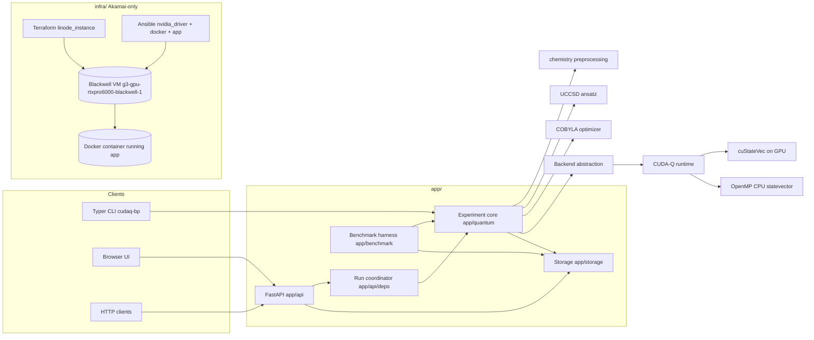
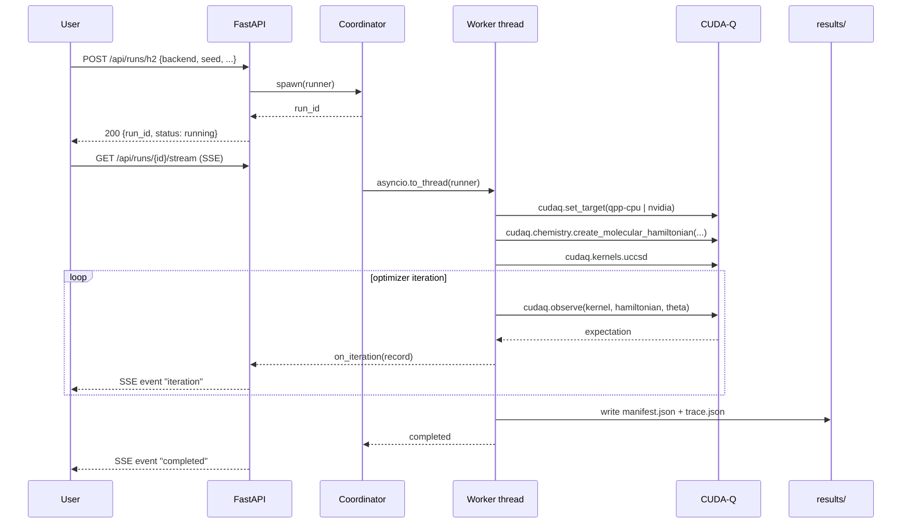

# Architecture

## High-level

The blueprint is a single Python package (`app/`) with thin CLI, API, and UI
front-doors over a shared core. Akamai-specific infrastructure lives entirely
under `infra/` and is invoked by `scripts/bootstrap_host.sh`.

## Module boundaries

`app/` is provider-agnostic. It does not import anything from `infra/` and
has no awareness of Akamai. The only "deployment" knowledge inside `app/` is
the `nvidia` vs `qpp-cpu` backend mapping in
[`app/quantum/backends.py`](https://github.com/jgdynamite/cudaq-molecular-simulation-blueprint/blob/main/app/quantum/backends.py), which is a CUDA-Q
concept, not an Akamai concept.

`infra/` contains everything Akamai-specific:

- [`infra/terraform/akamai/`](https://github.com/jgdynamite/cudaq-molecular-simulation-blueprint/tree/main/infra/terraform/akamai) - Terraform stack
  using the official `linode/linode` provider.
- [`infra/ansible/`](https://github.com/jgdynamite/cudaq-molecular-simulation-blueprint/tree/main/infra/ansible) - Ansible playbook + roles that
  install drivers, Docker, and the application container.
- [`infra/k8s/future/`](https://github.com/jgdynamite/cudaq-molecular-simulation-blueprint/tree/main/infra/k8s/future) - placeholder; LKE is an
  explicit non-goal for v1.

## Hybrid pipeline

## Result manifest

Every run writes `results/<run_id>/manifest.json` and
`results/<run_id>/trace.json`. The manifest captures the full
reproducibility context:

- CUDA-Q version, target string, RNG seed, optimizer settings.
- Geometry, basis set, charge, multiplicity, optional active-space.
- System info: OS, CPU, Python, NVIDIA driver, CUDA version, GPU model + UUID,
  memory, container digest (when applicable).
- Git SHA of the code that produced it.
- Final result: energy, parameters, iterations, wall time, error vs reference,
  whether chemical accuracy was reached.

This is the artifact downstream tools (`compare`, the UI, the blog post) all
read from. There is no database in v1 - the filesystem is the source of truth.

## Backend abstraction

`app/quantum/backends.py` exposes three logical backends:

| identifier  | CUDA-Q target   | hardware    | use case                               |
|-------------|-----------------|-------------|----------------------------------------|
| `cpu`       | `qpp-cpu`       | CPU/OpenMP  | local Mac/Linux, public reproducibility |
| `gpu_fp32`  | `nvidia` / fp32 | GPU         | speed-leaning runs                      |
| `gpu_fp64`  | `nvidia` / fp64 | GPU         | accuracy-leaning runs (the comparison)  |

Adding a new logical backend is a one-line change in `BACKEND_CONFIGS`. The
rest of the app (CLI, API, UI, benchmark) picks it up automatically through
the enum.
