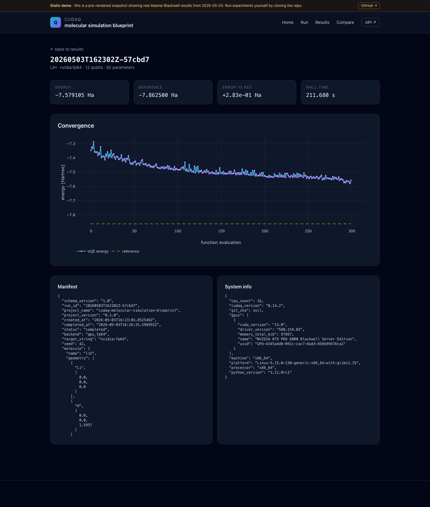

# Why GPUs Matter to Quantum Before QPUs Do

> Using CUDA-Q, cuQuantum, and NVIDIA Blackwell GPUs for molecular
> simulation, validated end-to-end on Akamai Cloud.

> **Status: blog post draft.** This Markdown lives in the repo at
> [`docs/blog-post-draft.md`](https://github.com/jgdynamite/cudaq-molecular-simulation-blueprint/blob/main/docs/blog-post-draft.md).
> Edit freely before publishing.
> Companion repo: <https://github.com/jgdynamite/cudaq-molecular-simulation-blueprint>
> Live UI: <https://cudaq-blueprint-demo.website-us-east-1.linodeobjects.com/>

---

## The hybrid reality of quantum development today

There's a comfortable narrative about quantum computing that goes like this:
the machines are coming, we'll port our workloads when they arrive, and
in the meantime our job is to wait for the hardware to mature. That story
is wrong in two interesting ways.

First, the workflow that practitioners actually run today is hybrid:
classical CPUs orchestrate, classical GPUs simulate, and a QPU is one
optional execution target among several. The same Python you'd write to
target a real QPU runs on a CPU statevector or a GPU statevector with a
single argument change. Most of the development cycle for a near-term
quantum algorithm happens against simulators long before any QPU time is
booked.

Second, the simulators that matter aren't toy ones. They're built on
the same vendor stack that makes ML competitive on big GPUs: NVIDIA's
[CUDA-Q](https://nvidia.github.io/cuda-quantum/) for the language and
runtime, [cuQuantum](https://developer.nvidia.com/cuquantum-sdk)'s
`cuStateVec` for the statevector kernels. CUDA-Q's `nvidia-fp64` target
runs the whole VQE loop &mdash; circuit construction, expectation
evaluation, parameter update &mdash; on the GPU with the optimizer on the
CPU. You don't write any CUDA. You write quantum kernels.

So if your reaction to the headline "we should buy a Blackwell to run
quantum" is "what, why?", this post is for you.

---

## The setup: H2 and LiH on a real Blackwell

To make this concrete we built
[`cudaq-molecular-simulation-blueprint`](https://github.com/jgdynamite/cudaq-molecular-simulation-blueprint),
a small reference implementation of the variational quantum eigensolver
(VQE) for two textbook molecules:

- **H<sub>2</sub>** at 0.74 &Aring; bond length, sto-3g basis, 4 qubits,
  3 UCCSD parameters. Maps to a small Hamiltonian where everything fits
  comfortably in CPU registers.
- **LiH** at 1.5957 &Aring; bond length, sto-3g basis, 2-electron /
  5-orbital active space, 12 qubits, 92 UCCSD parameters. Big enough that
  the statevector starts to be interesting on its own.

The driver is plain CUDA-Q + Python. Chemistry preprocessing uses
[OpenFermion](https://quantumai.google/openfermion) and
[PySCF](https://pyscf.org/) to produce a CUDA-Q `Hamiltonian`; the ansatz
is the bundled `cudaq.kernels.uccsd`; the optimizer is SciPy's COBYLA so
the comparison stays in plain classical optimizer territory. The whole
loop is a couple hundred lines of typed Python with full manifest and
trace capture for every run.

What changes between the CPU and GPU runs is the value of one string:

```python
# CPU
cudaq.set_target("qpp-cpu")

# GPU (FP64 cuStateVec)
cudaq.set_target("nvidia", option="fp64")
```

The hardware host is an Akamai Cloud `g3-gpu-rtxpro6000-blackwell-1`
instance in the Jakarta (`id-cgk`) region, provisioned and torn down
with Terraform + Ansible: NVIDIA RTX PRO 6000 Blackwell Server Edition,
driver `580.159.03` (the open kernel module branch &mdash; required for
Blackwell), CUDA 13.0, 96 GB VRAM, 16 vCPU, 172 GB system RAM. The full
deployment is one Terraform apply plus one Ansible playbook, all gated
behind an SSH key that exists only for the bench cycle. VM lifetime was
1 hour 17 minutes; billed cost was **$3.84**.

---

## Results

All four runs converged or hit the iteration cap; full manifests and
traces are
[attached to the v0.1.0 release](https://github.com/jgdynamite/cudaq-molecular-simulation-blueprint/releases/tag/v0.1.0).
Headline numbers:

| Run | Backend | Qubits | Wall time (s) | Energy (Ha) | Error vs FCI | Chemical accuracy |
|---|---|---:|---:|---:|---:|:---:|
| H<sub>2</sub>  | qpp-cpu     |  4 | **17.07** | -1.137270 | -1.75e-07 | yes |
| H<sub>2</sub>  | nvidia:fp64 |  4 |     19.19 | -1.137270 | -1.75e-07 | yes |
| LiH | qpp-cpu     | 12 |    362.02 | -7.579105 | +2.83e-01 | (cap) |
| LiH | nvidia:fp64 | 12 | **211.68** | -7.579105 | +2.83e-01 | (cap) |

Two stories show up in the data, and they both matter.

### Small problem: CPU wins by 1.12x

For a 4-qubit Hamiltonian, the CPU statevector backend (`qpp-cpu`,
OpenMP-parallel, 16 cores) finished H<sub>2</sub> in 17.07 seconds; the
GPU took 19.19. That's a 12% **handicap** for the GPU. There's no
mystery here: the per-evaluation cost of moving a 16-amplitude
statevector across the host&hairsp;-&hairsp;device boundary, launching a
kernel, and collecting an expectation value is dominated by overhead
when the actual numerical work is microseconds. CUDA-Q is doing
everything correctly &mdash; the GPU just doesn't have enough actual work
to chew on to amortize its setup tax.

This is the under-celebrated reality of GPU acceleration in any domain:
**there's a problem-size threshold below which the device is the wrong
tool**, and pretending otherwise produces a kind of cargo-cult
benchmarking. We logged this number specifically so that we wouldn't
sneak past it.

### Bigger problem: GPU wins by 1.71x

LiH on a 12-qubit, 92-parameter UCCSD ansatz tells a different story.
Both backends ran to the 300-iteration COBYLA cap, both reached the
same final energy (&minus;7.579105 Ha) with the same residual error
(+0.283 Ha vs FCI &mdash; more on that in a moment), but the wall-time
gap opened up:

- CPU: 362.02 s, 1206.75 ms per function evaluation.
- GPU FP64: **211.68 s**, **705.60 ms per function evaluation**.

That's a 1.71x wall-time speedup, a 39% reduction in wall time on an
identical convergence trajectory. The convergence chart is identical
under the optimizer's view; the GPU just gets through each iteration
faster:



This is the regime where a GPU starts paying its own freight. The
12-qubit statevector is 4096 complex amplitudes per evaluation, the
Hamiltonian has hundreds of Pauli terms, and each function evaluation
is doing real work that benefits from the parallelism. The Blackwell's
96 GB of VRAM is barely touched here &mdash; but it's the thing that
makes the next jump (16, 18, 20-qubit active spaces with bigger basis
sets) tractable on a single card.

The honest caveat: with only one seed per backend the standard error
on the wall-time numbers is zero by construction (`n=1`). A multi-seed
run is one of the obvious next steps, and the project is set up so
that swapping in `--seed` and re-running is a one-liner. The 1.71x
should be read as "directionally consistent with what we expect from
the architecture", not as a tight measurement.

### Why neither LiH run reached chemical accuracy

Both LiH runs end at the same energy with the same residual error
versus FCI (+0.283 Ha; chemical accuracy is 0.0016 Ha). That's not a
GPU vs CPU question &mdash; it's an optimizer question. COBYLA at 300
iterations with this ansatz on this active space stops short. The fix
is one of: a longer optimizer budget, parameter-shift gradients with
L-BFGS-B, or a richer ansatz. We chose to ship the honest first cut and
flag the limitation rather than tune until the headline read better.
The repo's
[`docs/results-interpretation.md`](https://github.com/jgdynamite/cudaq-molecular-simulation-blueprint/blob/main/docs/results-interpretation.md)
walks through the methodology and what we'd change next.

---

## What this teaches

A few takeaways that generalize beyond this specific workload.

**1. Quantum development is hybrid CPU + GPU + (sometimes) QPU, not
QPU-or-bust.** If your platform story for quantum tomorrow involves
ignoring the GPU layer today, you're going to have to re-platform
twice: once to add GPU acceleration, once again to add a QPU
execution target. Building the hybrid runtime first is the cheaper
path.

**2. There's a problem-size threshold for GPU advantage.** It's not
where the marketing decks suggest. Below it, your GPU is a tax. Above
it, the GPU pays for itself in wall time and unlocks problem sizes a
CPU can't touch at all. Knowing where the threshold is &mdash; for your
specific Hamiltonian shape, your specific ansatz, your specific
optimizer &mdash; is the engineering work. We've published two data
points so others can extend the curve.

**3. Reproducibility is a feature, not a footnote.** Every run in this
project captures CUDA-Q version, GPU model, driver version, CUDA
version, OS, container digest, git SHA, and seed. The bench tarball
is attached to the GitHub release with a SHA256. Anyone can re-run
this on their own Blackwell, on their own CPU, on their own laptop,
on their own cloud. That's the only way "X is N times faster than
Y" claims become useful.

**4. A blog companion can be a real artifact.** The
[live UI](https://cudaq-blueprint-demo.website-us-east-1.linodeobjects.com/)
isn't a screenshot. It's the actual Jinja2/HTMX UI rendered as a
static bundle and served from Akamai Object Storage. Visitors see the
real Blackwell host fingerprint, drill into the convergence chart of
each individual run, and read the same comparison report the CLI
spits out. The "Run an experiment" form is intentionally inert in
static mode &mdash; clicking submit redirects you to the GitHub repo,
because running cudaq from a public web bucket without auth is
exactly the kind of thing that makes security reviewers cry.

---

## Reproduce it yourself

CPU path, runs anywhere with Docker (~17 seconds for H<sub>2</sub>):

```bash
git clone https://github.com/jgdynamite/cudaq-molecular-simulation-blueprint.git
cd cudaq-molecular-simulation-blueprint
make container-build
make container-run-cpu
make serve   # local UI at http://localhost:8000
```

GPU path on Akamai Cloud (Blackwell SKU is feature-gated; talk to your
account team):

```bash
export LINODE_TOKEN=...
cd infra/terraform/akamai
cp terraform.tfvars.example terraform.tfvars
$EDITOR terraform.tfvars   # SSH key, region (id-cgk or br-gru), label

terraform init && terraform apply
ansible-playbook -i inventory.ini ../../ansible/playbook.yml \
    --private-key ~/.ssh/your-key

ssh root@$(terraform output -raw public_ip) \
    "docker exec cudaq-blueprint cudaq-bp bench compare"

terraform destroy   # mandatory; cost meter stops
```

Total cost for the bench cycle that produced the numbers above: **$3.84**
for 1 hour 17 minutes of `g3-gpu-rtxpro6000-blackwell-1` time.

The full Terraform module, Ansible roles, and Dockerfile are in the
repo under `infra/`. The application code is provider-agnostic &mdash; you
can lift the Docker image to any GPU host that has the NVIDIA Container
Toolkit and the open kernel modules installed and the same binary will
run.

---

## What's next

Three things we'd do before quoting these numbers in production:

- **Optimizer + ansatz upgrade.** Replace COBYLA with L-BFGS-B and
  parameter-shift gradients so LiH actually converges to chemical
  accuracy on a finite iteration budget. This is mostly a recipe
  swap; the rest of the pipeline doesn't move.
- **Multi-seed runs.** Five seeds per backend per molecule, so the
  comparison report's `stderr` columns mean something. Cost: about
  $1 of fresh Blackwell time.
- **Multi-GPU.** Akamai's
  `g3-gpu-rtxpro6000-blackwell-2` SKU has two cards; CUDA-Q's
  `nvidia-mgpu` target slices the statevector across them. We didn't
  use it for v0.1.0 because we wanted the comparison clean, but it's
  the obvious next data point and the SKU is approved on this
  account.

What's *not* on the list: a quantum-advantage claim, a cross-cloud
benchmark, or a Kubernetes story. Those are different posts, with
different threat models, on different timelines.

---

## Caveats and what this isn't

- **This is not a quantum-advantage claim.** The CPU runs the same VQE
  with the same convergence; the GPU just gets through each iteration
  faster on the larger of the two molecules.
- **This is not a positioning of Akamai as a dedicated quantum cloud.**
  The point is that Akamai already has Blackwell capacity, and the
  hybrid quantum workflow runs on Blackwell, so that hybrid quantum
  workflow runs on Akamai today &mdash; same as it would on any cloud
  with Blackwell capacity.
- **The application core is provider-agnostic.** Akamai-specific
  deployment lives entirely under `infra/`. Lift the Docker image
  anywhere that has Blackwell + the NVIDIA Container Toolkit.
- **The QPU column is empty by design.** Adding a QPU target is one
  CUDA-Q `set_target()` call away; we didn't ship it because it would
  shift the discussion off-topic. The point of this post is that the
  hybrid workflow is already worth standing up before the QPU column
  has a number in it.

---

## Links

- Repository: <https://github.com/jgdynamite/cudaq-molecular-simulation-blueprint>
- Documentation site: <https://jgdynamite.github.io/cudaq-molecular-simulation-blueprint/>
- Live UI snapshot: <https://cudaq-blueprint-demo.website-us-east-1.linodeobjects.com/>
- v0.1.0 release (with bench tarball + checksum):
  <https://github.com/jgdynamite/cudaq-molecular-simulation-blueprint/releases/tag/v0.1.0>
- Container image: `ghcr.io/jgdynamite/cudaq-molecular-simulation-blueprint:v0.1.0`
- CUDA-Q docs: <https://nvidia.github.io/cuda-quantum/>
- cuQuantum SDK: <https://developer.nvidia.com/cuquantum-sdk>
- Akamai Cloud GPU SKUs: <https://www.linode.com/products/gpu/>
